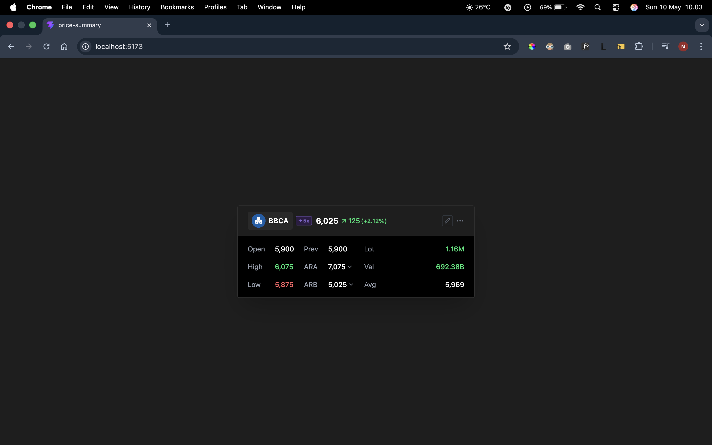
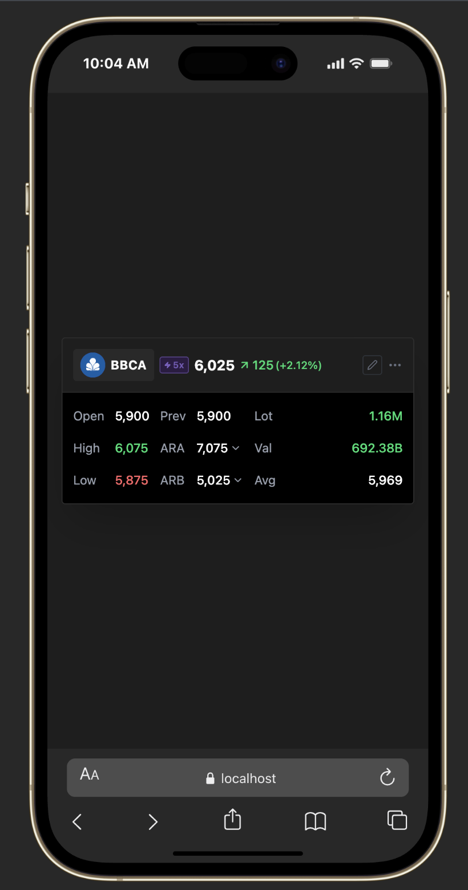

# Price Summary Ilham

A lightweight web application to display IDX stock price summaries including Open, High, Low, Prev Close, Change, ARA/ARB, Lot, Value, and Average. Built with React + TypeScript, designed mobile-first with automatic data fallback when the API rate limit is reached.

---

## Preview




---

## Badges


---

## Tech Stack

| Technology |
|-----------|
| **React 19** |
| **TypeScript 6** | 
| **Vite 8** | 
| **TanStack Query v5** |
| **Axios** | 
| **Tailwind CSS v4** |
| **Lucide React** | 

---

## Prerequisites

- **Node.js** version `>= 18` (recommended: latest LTS)
- **npm** (included with Node.js)
- **Alpha Vantage API Key** — free, register at [alphavantage.co](https://www.alphavantage.co/support/#api-key)
- **Supported OS:** macOS, Windows, Linux

---

## Getting Started

### 1. Clone the repo

```bash
git clone https://github.com/ilhamramdanii/price-summary-ilham.git
cd price-summary-ilham
```

### 2. Install dependencies

```bash
npm install
```

### 3. Setup environment variables

Copy the `.env.example` file to `.env`:

```bash
cp .env.example .env
```

Then fill in the API key in the `.env` file:

```env
VITE_ALPHA_VANTAGE_BASE_URL=https://www.alphavantage.co/query
VITE_ALPHA_VANTAGE_API_KEY=YOUR_API_KEY_HERE
```

### 4. Run the dev server

```bash
npm run dev
```

Open your browser at `http://localhost:5173`

---

## Features

- **Price summary** — displays Open, High, Low, Prev Close, ARA, ARB, Lot, Value, and Average
- **Automatic color indicators** — green when price rises, red when it falls, based on the Change value
- **Leverage badge** — displays margin info (e.g.: +5x) for supported stocks
- **Layered caching** — API responses are cached in localStorage (24 hours) and React Query (5 minutes) to minimize quota usage
- **Automatic fallback** — if the API rate limit is reached or the symbol is unrecognized, the app automatically uses mock data to keep the UI functional

---

## Folder Structure

```
src/
├── components/
│   ├── PriceSummaryCard/         # Main price card, split by responsibility
│   │   ├── PriceSummaryCard.tsx  # Composition: routing to Loading/Error/Success state
│   │   ├── PriceHeader.tsx       # Top row: symbol, price, change %
│   │   ├── PriceGrid.tsx         # 3-row grid: Open/High/Low + other metrics
│   │   ├── LoadingSkeleton.tsx   # Animated placeholder while data is loading
│   │   ├── ErrorCard.tsx         # Display when fetch fails
│   │   └── index.ts              # Barrel export
│   └── StockSelector/            # Dropdown to select stock symbol
│       ├── StockSelector.tsx
│       └── index.ts
│
├── constants/
│   ├── config.ts                 # Env vars with startup validation
│   └── stockSymbols.ts           # Stock list and leverage configuration
│
├── hooks/
│   ├── useStockData.ts           # Fetch + cache price data via React Query
│   └── useStockSymbol.ts         # State of the currently selected stock symbol
│
├── services/
│   ├── apiClient.ts              # Axios instance with timeout
│   ├── cacheService.ts           # Read/write cache to localStorage
│   ├── mockData.ts               # Fallback data when API is unavailable
│   ├── priceTransformer.ts       # Transform raw API → PriceInfo + IDX calculations
│   └── stockService.ts           # Orchestrates fetch, cache, and fallback
│
├── types/
│   ├── ApiResponse.ts            # Alpha Vantage API response interface
│   ├── PriceInfo.ts              # Transformed price data interface
│   └── StockData.ts              # Stock symbol interface
│
└── utils/
    └── formatters.ts             # Pure functions: formatPrice, formatLot, formatVal
```

Each folder is separated by **single responsibility**: `services/` only knows about data, `components/` only knows about display, and `hooks/` bridges the two. No business logic in components, no UI logic in services.

---

## Environment Variables

| Variable | Purpose | Example Value |
|----------|--------|--------------|
| `VITE_ALPHA_VANTAGE_BASE_URL` | Alpha Vantage endpoint base URL | `https://www.alphavantage.co/query` |
| `VITE_ALPHA_VANTAGE_API_KEY` | API key for request authentication | `YOUR_API_KEY_HERE` |

---

## Limitations

| Limitation | Detail |
|----------|--------|
| **Alpha Vantage rate limit (free tier)** | Maximum 25 requests per day. The app automatically falls back to mock data when the limit is reached |
| **IDX symbol suffix** | Alpha Vantage requires the `.JK` suffix for IDX stocks (e.g.: `BBCA.JK`, not `BBCA`). Symbols without the suffix may return US stock data with the same ticker, or an error |
| **Static mock data** | Fallback data uses hardcoded prices, not accurate historical prices |

---

## License

**MIT**. 
